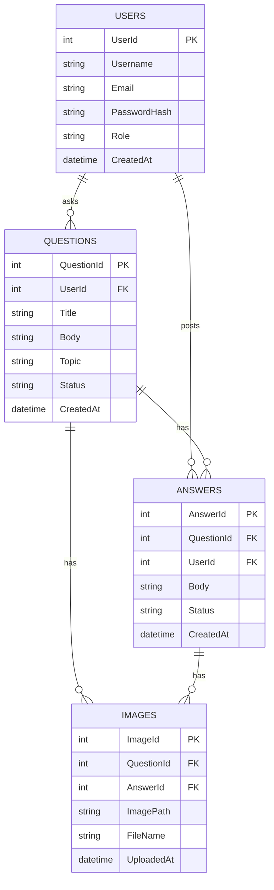

# DoConnect — Entity Relationship Diagram

## Overview

The DoConnect database is designed around four core entities: **Users**, **Questions**, **Answers**, and **Images**. The schema supports a Q&A platform where users can post questions and answers, admins can moderate content through an approval workflow, and images can be optionally attached to both questions and answers.

---

## ER Diagram



---

## Entity Descriptions

### USERS
The central entity of the system. Every person who interacts with the platform is a user. The `Role` field distinguishes between regular users (`User`) and administrators (`Admin`). Passwords are stored as plain text in this implementation (can be upgraded to BCrypt for production).

| Field | Type | Description |
|-------|------|-------------|
| UserId | INT | Primary key, auto-incremented |
| Username | NVARCHAR(100) | Display name of the user |
| Email | NVARCHAR(200) | Unique email used for login |
| PasswordHash | NVARCHAR(MAX) | Stored password |
| Role | NVARCHAR(50) | Either `User` or `Admin` |
| CreatedAt | DATETIME2 | Timestamp when account was created |

---

### QUESTIONS
Represents a question posted by a user. Each question goes through an approval workflow managed by the admin. The `Status` field tracks the current state of the question in that workflow.

| Field | Type | Description |
|-------|------|-------------|
| QuestionId | INT | Primary key, auto-incremented |
| UserId | INT | Foreign key referencing the user who asked |
| Title | NVARCHAR(300) | Short descriptive title of the question |
| Body | NVARCHAR(MAX) | Full detailed body of the question |
| Topic | NVARCHAR(100) | Category tag (e.g. Angular, Security) |
| Status | NVARCHAR(50) | `Pending`, `Approved`, or `Rejected` |
| CreatedAt | DATETIME2 | Timestamp when question was posted |

---

### ANSWERS
Represents an answer posted by a user in response to a question. Like questions, answers also go through admin approval before becoming publicly visible. A single question can have multiple answers from different users.

| Field | Type | Description |
|-------|------|-------------|
| AnswerId | INT | Primary key, auto-incremented |
| QuestionId | INT | Foreign key referencing the question being answered |
| UserId | INT | Foreign key referencing the user who answered |
| Body | NVARCHAR(MAX) | Full text of the answer |
| Status | NVARCHAR(50) | `Pending`, `Approved`, or `Rejected` |
| CreatedAt | DATETIME2 | Timestamp when answer was posted |

---

### IMAGES
Stores image metadata for files uploaded by users. An image can be attached to either a question or an answer, but not both at the same time. Both `QuestionId` and `AnswerId` are nullable foreign keys — only one will have a value depending on which entity the image belongs to. The actual image file is stored on the server and the path is saved in `ImagePath`.

| Field | Type | Description |
|-------|------|-------------|
| ImageId | INT | Primary key, auto-incremented |
| QuestionId | INT (NULL) | FK to Questions — set if image belongs to a question |
| AnswerId | INT (NULL) | FK to Answers — set if image belongs to an answer |
| ImagePath | NVARCHAR(MAX) | Server path to the image file (e.g. /uploads/filename.jpg) |
| FileName | NVARCHAR(MAX) | Unique generated filename stored on disk |
| UploadedAt | DATETIME2 | Timestamp when image was uploaded |

---

## Relationships

### Users → Questions (One-to-Many)
One user can ask many questions. Each question must belong to exactly one user. If a user is deleted, all their questions are deleted via `CASCADE`.

```
USERS (1) ──────────────── (Many) QUESTIONS
       UserId = Questions.UserId
```

---

### Users → Answers (One-to-Many)
One user can post many answers across different questions. Each answer must belong to exactly one user. Delete behaviour is set to `NO ACTION` to avoid multiple cascade paths in SQL Server.

```
USERS (1) ──────────────── (Many) ANSWERS
       UserId = Answers.UserId
```

---

### Questions → Answers (One-to-Many)
One question can have many answers. Each answer must belong to exactly one question. If a question is deleted, all its answers are deleted via `CASCADE`.

```
QUESTIONS (1) ──────────── (Many) ANSWERS
          QuestionId = Answers.QuestionId
```

---

### Questions → Images (One-to-Many)
One question can have many images attached. Each image optionally belongs to one question. `QuestionId` is nullable in Images. Delete is set to `NO ACTION`.

```
QUESTIONS (1) ──────────── (Many) IMAGES
          QuestionId = Images.QuestionId (nullable)
```

---

### Answers → Images (One-to-Many)
One answer can have many images attached. Each image optionally belongs to one answer. `AnswerId` is nullable in Images. Delete is set to `NO ACTION`.

```
ANSWERS (1) ────────────── (Many) IMAGES
        AnswerId = Images.AnswerId (nullable)
```

---

## Design Decisions

### Why is the Images table nullable on both FKs?
An image can belong to either a question or an answer — never both. Rather than creating two separate image tables (`QuestionImages` and `AnswerImages`), a single `Images` table is used with two nullable foreign keys. At any time, exactly one of `QuestionId` or `AnswerId` will have a value and the other will be `NULL`.

### Why use a Status field instead of a separate table?
The approval workflow is simple — three states: `Pending`, `Approved`, `Rejected`. A `Status` string column on both `Questions` and `Answers` is clean, fast to query, and avoids unnecessary table joins. This keeps the schema minimal while fully supporting the moderation workflow.

### Why separate Answers from Questions?
A question and its answers are separate entities with different lifecycles. An answer has its own approval status, its own author, and its own images. Separating them into two tables gives full control over moderation at the answer level, not just the question level.

### Why store Role in the Users table?
Role-based access control (RBAC) is straightforward in this system — there are only two roles. Storing `Role` as a string column in `Users` avoids an extra join to a roles table and keeps the JWT token generation simple. The role is included directly in the JWT claims.

---

## SQL Script

```sql
CREATE TABLE Users (
    UserId       INT PRIMARY KEY IDENTITY(1,1),
    Username     NVARCHAR(100)  NOT NULL,
    Email        NVARCHAR(200)  NOT NULL UNIQUE,
    PasswordHash NVARCHAR(MAX)  NOT NULL,
    Role         NVARCHAR(50)   NOT NULL DEFAULT 'User',
    CreatedAt    DATETIME2      NOT NULL DEFAULT GETUTCDATE()
);

CREATE TABLE Questions (
    QuestionId INT PRIMARY KEY IDENTITY(1,1),
    Title      NVARCHAR(300) NOT NULL,
    Body       NVARCHAR(MAX) NOT NULL,
    Topic      NVARCHAR(100) NOT NULL,
    Status     NVARCHAR(50)  NOT NULL DEFAULT 'Pending',
    CreatedAt  DATETIME2     NOT NULL DEFAULT GETUTCDATE(),
    UserId     INT           NOT NULL,
    FOREIGN KEY (UserId) REFERENCES Users(UserId) ON DELETE CASCADE
);

CREATE TABLE Answers (
    AnswerId   INT PRIMARY KEY IDENTITY(1,1),
    Body       NVARCHAR(MAX) NOT NULL,
    Status     NVARCHAR(50)  NOT NULL DEFAULT 'Pending',
    CreatedAt  DATETIME2     NOT NULL DEFAULT GETUTCDATE(),
    QuestionId INT           NOT NULL,
    UserId     INT           NOT NULL,
    FOREIGN KEY (QuestionId) REFERENCES Questions(QuestionId) ON DELETE CASCADE,
    FOREIGN KEY (UserId)     REFERENCES Users(UserId)
);

CREATE TABLE Images (
    ImageId    INT PRIMARY KEY IDENTITY(1,1),
    ImagePath  NVARCHAR(MAX) NOT NULL,
    FileName   NVARCHAR(MAX) NOT NULL,
    UploadedAt DATETIME2     NOT NULL DEFAULT GETUTCDATE(),
    QuestionId INT           NULL,
    AnswerId   INT           NULL,
    FOREIGN KEY (QuestionId) REFERENCES Questions(QuestionId),
    FOREIGN KEY (AnswerId)   REFERENCES Answers(AnswerId)
);
```

---

## Status Values

| Entity | Status | Meaning |
|--------|--------|---------|
| Question | Pending | Newly posted, awaiting admin review |
| Question | Approved | Approved by admin, visible to all users |
| Question | Rejected | Rejected by admin, not visible |
| Answer | Pending | Newly posted, awaiting admin review |
| Answer | Approved | Approved by admin, visible on question page |
| Answer | Rejected | Rejected by admin, not visible |
